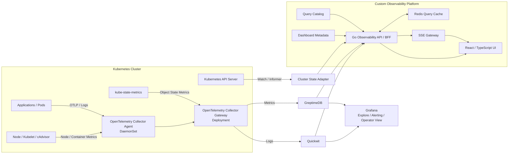

# K8s Dashboard

Kubernetes 운영자가 클러스터 이상을 빠르게 발견하고, 관련 Workload·Pod·Container의 메트릭·로그·이벤트·알림까지 일관된 흐름으로 분석할 수 있도록 구축하는 커스텀 Observability Dashboard입니다.

이 프로젝트는 Grafana를 대체하는 범용 시각화 도구를 새로 만드는 것이 목적이 아닙니다. 기존의 안정적인 수집·저장·알림 계층을 유지하면서, Kubernetes 운영 업무에 특화된 사용자 경험과 통합 조회 계층을 추가하는 것을 목표로 합니다.

> 장애 발견 → Namespace/Workload 확인 → Pod/Container 상태 확인 → Metric/Log/Event/Alert 상관분석

---

## 1. 배경

현재 모니터링 스택은 다음과 같습니다.

- **Grafana**: 대시보드, Explore, Alerting
- **GreptimeDB**: Metrics 저장 및 조회
- **Quickwit**: Logs 저장 및 검색
- **Kubernetes API**: Workload, Pod, Node, Event 등 현재 상태

기존 구성은 운영과 데이터 조회 측면에서는 유효하지만, 다음 요구사항을 충족하기 어렵습니다.

- 서비스 목적에 맞춘 완전한 커스텀 UI/UX
- Cluster → Namespace → Workload → Pod 단위의 자연스러운 Drill-down
- Metric, Log, Kubernetes Event, Alert의 통합 상관분석
- 사용자·조직별 Cluster/Namespace 접근 권한 통제
- 대시보드마다 반복되는 쿼리, 필터, 상태 처리의 표준화
- 고비용 쿼리와 대량 로그 조회에 대한 서버 측 보호

따라서 수집·저장 계층을 다시 만드는 대신, 별도의 **Observability API/BFF**와 **React 기반 Custom UI**를 구축합니다.

---

## 2. 핵심 설계 원칙

1. **기존 데이터 계층을 우선 재사용합니다.**
   - Metrics: GreptimeDB
   - Logs: Quickwit
   - Alerting/Explore: Grafana 또는 Alertmanager

2. **브라우저는 데이터 저장소를 직접 호출하지 않습니다.**
   - 모든 요청은 Go 기반 Observability API/BFF를 거칩니다.
   - 인증, 권한, 쿼리 제한, 캐시, 응답 정규화를 서버에서 강제합니다.

3. **Grafana는 제거하지 않습니다.**
   - SRE/운영자를 위한 Explore, 원본 데이터 검증, Alerting 도구로 유지합니다.

4. **범용 Query Builder보다 운영 흐름을 우선합니다.**
   - MVP에서는 사전에 검증된 Query Catalog를 사용합니다.
   - 임의 PromQL, SQL, Quickwit Raw Query 입력은 기본적으로 허용하지 않습니다.

5. **시계열과 상태 변경의 전달 방식을 분리합니다.**
   - Metrics: HTTP Query/Polling
   - Pod, Workload, Event, Alert 상태 변경: SSE
   - 양방향 통신이 필요한 경우에만 WebSocket을 검토합니다.

6. **모든 데이터는 공통 엔티티 모델로 연결합니다.**
   - Cluster → Namespace → Workload → Pod → Container
   - Pod 이름보다 Pod UID와 Workload UID를 우선 사용합니다.

7. **알림 엔진을 새로 구현하지 않습니다.**
   - Alert Rule Evaluator, Silence, Grouping, Notification Routing은 기존 Grafana Alerting 또는 Alertmanager를 사용합니다.

---

## 3. 목표 아키텍처



> OpenTelemetry 수집 표준화는 MVP 이후 단계입니다. 초기 버전은 현재 운영 중인 수집 경로를 재사용합니다.

---

## 4. 주요 컴포넌트

### 4.1 Observability API / BFF

Go로 구현하며 다음 책임을 가집니다.

- OIDC 인증 및 RBAC
- Cluster/Namespace Scope 강제
- GreptimeDB Metrics Adapter
- Quickwit Logs Adapter
- Kubernetes Shared Informer Cache
- Query Catalog 실행
- Redis 캐시 및 요청 중복 제거
- Rate Limit, Timeout, Circuit Breaker
- 공통 응답 DTO 변환
- SSE 기반 상태 이벤트 전송
- 감사 로그 및 자체 운영 지표

### 4.2 Custom Web UI

React와 TypeScript를 기반으로 구축합니다.

- Cluster Overview
- Namespace Overview
- Workload/Pod 상세 화면
- Pod Topology (Pod 간 통신 현황 및 방향별 요청 분석) *(구현됨 — mock API 기준)*
- Logs Explorer *(구현됨 — mock API 기준)*
- Metric/Log/Event/Alert 상관분석 *(구현됨 — mock API 기준)*
- Dashboard DSL 기반 Widget 렌더링
- 사용자 권한에 따른 Scope Selector
- 부분 갱신과 자동 새로고침
- 반응형 레이아웃과 접근성

### 4.3 Cluster State Adapter

Kubernetes API를 매 요청마다 직접 조회하지 않고 Shared Informer Cache를 사용합니다.
**요청당 API 서버 호출은 0회입니다.** 구현과 근거는 [`apps/api/README.md`](./apps/api/README.md)와
[ADR 0004](./docs/adr/0004-backend-language-go.md)에 있습니다. *(구현됨)*

| 리소스 | informer | 이유 |
|---|---|---|
| Pod · Node · Deployment · StatefulSet · DaemonSet · CronJob | typed (protobuf 협상) | spec/status가 화면에 필요합니다 |
| ReplicaSet | **metadata-only** (`PartialObjectMetadata`) | 소유 관계와 revision 애노테이션만 씁니다 |
| Kubernetes Event | typed + `type=Warning` 필드 셀렉터 | 수가 가장 많은 리소스라 범위를 좁혀 watch합니다 |

인덱스 세 개(`podByOwner` · `replicaSetByOwner` · `eventByInvolved`)로 Deployment → Pod 조회가
전체 순회 대신 인덱스 두 번으로 끝납니다.

주요 정규화 대상:

- CrashLoopBackOff
- ImagePullBackOff
- Pending/Scheduling Failure
- Replica 불일치
- Node NotReady/Pressure
- Deployment Rollout 상태

### 4.4 Design System

구현에 앞서 디자인 토큰과 핵심 컴포넌트를 먼저 확정합니다. 자세한 규칙은
[`design-system/README.md`](./design-system/README.md), 결정 배경은
[ADR 0001](./docs/adr/0001-design-system-with-claude-design.md)에 있습니다.

- **원천은 git입니다.** `design-system/tokens/`가 단일 원천이며 `apps/web`은 토큰만 참조합니다.
  컴포넌트 코드에 원시 hex나 임의 픽셀값을 쓰지 않습니다.
- **리뷰 표면은 Claude Design입니다.** 컴포넌트별 `*.preview.html`을 자기완결 HTML로 빌드해
  **design-sync**로 업로드하고, 팀은 카드 단위로 보고 논의합니다. 동기화는 한 번에 한 컴포넌트씩
  증분으로 수행합니다.
- **상태 색은 예약어입니다.** `good / warning / serious / critical`을 차트 계열 색으로
  재사용하지 않고, 항상 아이콘 + 텍스트 라벨과 함께 렌더링합니다.
- **차트 팔레트는 검증된 값만 씁니다.** 명도 대역 · 채도 하한 · 인접 쌍 색각 이상 분리 ·
  정상 시야 하한 · 표면 대비를 Light/Dark 두 모드에서 통과한 8슬롯 고정 순서 팔레트를 사용하며,
  계열 색을 바꿀 때는 검증을 재실행하고 결과를 기록합니다.
- **Light/Dark는 자동 반전이 아닙니다.** 각 표면에 맞춰 별도로 고른 값을 선언하며,
  사용자 테마 토글이 OS 설정보다 우선합니다.

### 4.5 Query Catalog

프런트엔드에서 Raw Query를 직접 전달하지 않고, 서버에 등록된 `queryRef`를 사용합니다.

```yaml
id: workload_cpu_usage
title: Workload CPU Usage
type: timeseries
unit: percent
query: |
  sum(
    rate(container_cpu_usage_seconds_total{
      cluster="$cluster",
      namespace="$namespace",
      pod=~"$pod"
    }[5m])
  ) by (pod)
defaultRange: 1h
minStep: 15s
maxDataPoints: 800
permissions:
  - namespace.viewer
```

서버는 다음 항목을 강제합니다.

- 변수 Allowlist 및 Escaping
- Cluster/Namespace Scope 필터
- 최대 시간 범위
- 최소 Step
- 최대 Data Point
- Timeout
- 결과 크기 제한

---

## 5. Unified Entity Model

Metric, Log, Kubernetes Event, Alert를 연결하기 위한 공통 식별 모델을 정의합니다.

```text
Cluster
└── Namespace
    └── Workload
        └── Pod
            └── Container
```

주요 공통 속성:

```text
cluster.id
k8s.cluster.name
k8s.namespace.name
k8s.workload.kind
k8s.workload.name
k8s.workload.uid
k8s.pod.name
k8s.pod.uid
k8s.container.name
k8s.node.name
service.name
service.namespace
service.version
trace_id
span_id
```

식별 우선순위:

```text
Pod UID
  ↓
Workload UID
  ↓
Namespace + Workload Kind + Workload Name
  ↓
Pod Name
```

---

## 6. 기술 스택

| 영역 | 기술 |
|---|---|
| Frontend | React, TypeScript, Vite 또는 Next.js |
| Design System | CSS Custom Properties 기반 토큰, Claude Design + design-sync |
| Server State | TanStack Query |
| UI State | Zustand |
| Chart | Apache ECharts 또는 uPlot |
| Table | TanStack Table, React Virtual |
| Backend | Go |
| Kubernetes Client | client-go, Shared Informer |
| Metrics | GreptimeDB, PromQL, SQL |
| Logs | Quickwit REST Search API |
| Alerting | Grafana Alerting 또는 Alertmanager |
| Cache | Redis |
| Dashboard Metadata | Git, 추후 PostgreSQL |
| Authentication | OIDC / MS Entra |
| Telemetry | OpenTelemetry |
| Deployment | Helm 또는 Kustomize |

기술 선택은 ADR 검토 후 확정합니다.

---

## 7. 예상 저장소 구조

```text
k8s-dashboard/
├── apps/
│   ├── api/                    # Go Observability API/BFF
│   └── web/                    # React/TypeScript UI
├── design-system/              # 디자인 토큰 · 컴포넌트 스타일 · Claude Design preview
│   ├── tokens/                 #   color / typography / layout (단일 원천)
│   ├── components/             #   컴포넌트 CSS + *.preview.html
│   ├── foundations/            #   토큰 자체를 보여주는 preview
│   ├── previews/               #   preview 전용 레이아웃
│   ├── scripts/                #   preview 빌드
│   └── dist/                   #   빌드 산출물 (design-sync 업로드 대상, gitignore)
├── packages/
│   ├── contracts/              # 화면 단위 응답 계약 (TypeScript, 추후 OpenAPI 생성)
│   ├── dashboard-schema/       # Dashboard DSL
│   └── query-catalog/          # Query 정의
├── deploy/
│   ├── helm/
│   ├── kustomize/
│   └── local/
├── docs/
│   ├── adr/
│   ├── architecture/
│   ├── runbooks/
│   └── security/
├── scripts/
├── CLAUDE.md
├── Makefile
└── README.md
```

`design-system/`을 제외한 실제 구조는 Bootstrap 이슈에서 확정합니다.

---

## 8. MVP 범위

### 포함

- Go Observability API/BFF
- GreptimeDB Metrics 조회
- Quickwit Logs 검색
- Kubernetes Informer 기반 상태 조회
- OIDC 인증과 Cluster/Namespace RBAC
- Query Catalog
- Redis 캐시와 쿼리 보호 정책
- Cluster Overview *(구현됨 — mock API 기준)*
- Namespace Overview
- Workload/Pod 상세
- Pod Topology 및 방향별 요청 집계
- Logs Explorer
- Metric/Log/Event/Alert Drill-down
- Grafana Alerting 또는 Alertmanager 조회 연동 *(UI 구현됨 — Adapter는 백엔드 과제)*
- Dashboard DSL 기반 읽기 전용 대시보드
- Helm/Kustomize 배포
- CI, 보안 검증, E2E 테스트

### 제외

- Grafana 전체 기능 대체
- Raw PromQL/SQL/Quickwit Query Editor
- 자체 Alert Rule Evaluator
- 자체 Silence/Grouping/Notification Router
- 완전한 Dashboard Builder
- AI 기반 이상 탐지
- Multi-cluster 중앙 Agent 구조
- 기존 수집 파이프라인의 즉시 교체

---

## 9. 주요 사용자 흐름

### 장애 조사

```text
Cluster Overview
  → Unhealthy Workload
    → Workload Detail
      → Problematic Pod
        → Metrics
        → Logs
        → Kubernetes Events
        → Related Alerts
```

### 통신 경로 분석

```text
Pod Topology
  → 문제 있는 방향의 선 선택 (A→B와 B→A는 별도 선)
    → API/Route별 누적 요청 수
      → 시계열 전환 (범위별 자동 Step)
        → 비정상 Pod 목록 → Pod 로그
```

### 자원 사용 분석

```text
Cluster
  → Namespace
    → Workload
      → Request/Limit 대비 실제 사용량
      → CPU/Memory/Network 추세
      → 과다 또는 과소 할당 확인
```

### 알림 분석

```text
Active Alert
  → 관련 Workload/Pod 식별
  → 동일 시간대 Metrics 확인
  → Error/Warn Logs 확인
  → Kubernetes Event 확인
  → Grafana 원본 Alert 화면 이동
```

---

## 10. 보안 원칙

- UI가 전달한 Cluster/Namespace 값을 신뢰하지 않습니다.
- 사용자 권한 Scope는 서버에서 강제 삽입합니다.
- 데이터소스 Credential은 브라우저에 노출하지 않습니다.
- Quickwit/GreptimeDB/Kubernetes API 접근은 서버에서만 수행합니다.
- 최소 권한 ServiceAccount와 NetworkPolicy를 사용합니다.
- 로그 내 Token, Password, Secret 등 민감정보를 마스킹합니다.
- Query 실행 이력을 감사 로그로 남깁니다.
- 사용자 권한 Scope를 캐시 키에 포함합니다.
- Secret은 Git에 저장하지 않습니다.

초기 역할 예시:

```text
cluster.viewer
namespace.viewer
dashboard.editor
alert.viewer
platform.admin
```

---

## 11. 성능 원칙

- 브라우저에 대량 시계열 포인트를 그대로 전송하지 않습니다.
- 조회 범위에 따라 Step과 Downsampling을 조정합니다.
- 로그는 Cursor/Search-after 방식으로 조회합니다. offset은 쓰지 않습니다 (ADR 0003).
- 동일 In-flight Query는 Singleflight로 병합합니다.
- 현재 상태, 단기 시계열, 과거 데이터에 서로 다른 TTL을 적용합니다.
- 요청 취소를 GreptimeDB와 Quickwit 요청까지 전파합니다.
- 사용자별 Rate Limit과 Query Budget을 적용합니다.
- 데이터소스별 Timeout과 Circuit Breaker를 적용합니다.

예상 Step 정책:

| 조회 범위 | 기본 Step |
|---|---:|
| 최근 15분 | 5~10초 |
| 최근 1시간 | 15~30초 |
| 최근 24시간 | 1~5분 |
| 최근 30일 | 1시간 집계 |

Pod Topology의 요청 수 시계열은 위 정책의 구체화입니다.
1시간→1분, 1일→5분, 7일→15분, 30일→1시간이며, Step은 사용자가 고르지 않고 서버가 강제합니다.
Custom Range의 최대 폭은 30일입니다.

---

## 12. 개발 로드맵

### Phase 1 — Architecture & Foundation

- MVP 범위와 ADR 확정
- Monorepo Bootstrap *(Node workspace · Go 모듈 구성 완료)*
- Design System 기반 정립 (토큰, 핵심 컴포넌트, Claude Design 동기화) *(완료)*
- React 앱 셸과 데이터 접근 계층 *(완료 — mock API 기준)*
- Unified Entity Model
- Go API/BFF 기본 구조 *(완료 — 화면 단위 엔드포인트 · Scope 강제 · Section 봉투)*

### Phase 2 — Data Access

- 데이터소스 어댑터 경계 정의 *(완료 — 인터페이스 + 결정적 데모 구현)*
- Kubernetes Informer Adapter *(완료)*
- GreptimeDB Adapter *(완료 — Prometheus 호환 API · 서버 측 쿼리 카탈로그 · Step 상한)*
- Quickwit Adapter *(완료 — ES 호환 검색 · 커서 페이징 · 서버 마스킹)*
- Query Catalog *(최소 구현 — `apps/api/internal/datasource/greptime/queries.go`의 패널 카탈로그. 등록형 queryRef 계층은 #9)*
- OIDC/RBAC *(`scope.Resolver` 인터페이스까지 준비됨)*
- Redis Cache 및 Query Guardrail *(프로세스 내 TTL + singleflight까지 구현됨)*

### Phase 3 — Core UI

- Design System 컴포넌트 확장 (로그 뷰어, 표·차트 가상화)
- Cluster Overview *(선행 구현됨 — 실제 API 연결 대기)*
- Namespace / Workload / Pod Drill-down *(선행 구현됨 — 실제 API 연결 대기)*
- Logs Explorer 및 Metric→Log→Event 상관분석 *(선행 구현됨 — 실제 API 연결 대기)*
- Pod Topology · Alerts 조회 화면 *(선행 구현됨 — 실제 API 연결 대기)*
- Namespace Overview
- Workload/Pod Detail
- Logs Explorer
- Alert Integration

### Phase 4 — Platformization

- Dashboard DSL
- Helm/Kustomize 배포
- 자체 모니터링
- CI, 보안, 성능 테스트
- MVP E2E 검증

### Post-MVP

- OpenTelemetry Agent/Gateway 표준화
- Dashboard Builder
- Multi-cluster Agent
- Service Topology
- SLO/Error Budget
- 배포 전후 성능 비교
- 이상 징후 탐지

---

## 13. 개발 환경

프로젝트 초기 구조가 생성되기 전까지 아래 명령은 예정 인터페이스입니다.

```bash
# 저장소 복제
git clone https://github.com/xenx96/k8s-dashboard.git
cd k8s-dashboard

# 의존성 설치
make install

# Web 실행 — MSW mock API 위에서 단독으로 동작합니다 (http://localhost:5173)
make dev

# API 실행 — kubeconfig 또는 in-cluster 설정을 자동으로 찾습니다 (http://localhost:8080)
make dev-api

# 디자인 시스템 미리보기 빌드 (Claude Design 업로드 대상)
make design

# 검증
make check          # 타입체크 + preview 빌드 검증
make build          # 전체 빌드
make test           # Web E2E(Playwright) + Go 테스트
```

Web과 API는 각각 단독으로 돌아갑니다. Web은 MSW mock 위에서, API는 `USE_DEMO_DATA=true`로
GreptimeDB/Quickwit/Alertmanager 없이 뜹니다. CI는 로컬과 **같은 명령**을 씁니다.

화면 상태(부분 장애 · 권한 없음 · 빈 결과)는 URL 쿼리로 재현할 수 있습니다.
자세한 내용은 [`apps/web/README.md`](./apps/web/README.md)와 [`apps/api/README.md`](./apps/api/README.md)를
참고하세요.

---

## 14. 완료 기준

MVP는 다음 조건을 모두 만족할 때 완료된 것으로 판단합니다.

- Cluster Overview에서 주요 이상 상태를 확인할 수 있습니다.
- Namespace와 Workload/Pod 단위로 Drill-down할 수 있습니다.
- 동일 엔티티와 시간 범위의 Metric, Log, Event, Alert가 연결됩니다.
- Cluster/Namespace 권한 경계를 우회할 수 없습니다.
- Query Timeout, Range, Data Point, Result Size 제한이 적용됩니다.
- 데이터소스 일부 장애 시 나머지 화면이 Degraded Mode로 동작합니다.
- 주요 장애 시나리오가 E2E 테스트로 재현됩니다.
- 배포, 장애 대응, Rollback Runbook이 존재합니다.

---

## 15. 프로젝트 상태

현재 단계: **Architecture / Initial Planning**

초기 구현 전 다음 내용을 먼저 확정합니다.

- ADR과 MVP 비목표
- 저장소 구조
- Design System 기반 *(완료 — 토큰, 7개 컴포넌트, preview 8종)*
- Cluster Overview 화면 *(mock API 위에서 동작 · 이슈 #14)*
- Namespace / Workload / Pod Drill-down *(mock API 위에서 동작 · 이슈 #15)*
- Logs Explorer 및 상관분석 *(mock API 위에서 동작 · 이슈 #16)*
- Pod Topology · Alerts *(mock API 위에서 동작 · 이슈 #17)*
- Unified Entity Model
- API 계약
- 인증 및 권한 모델
- Query Catalog Schema

세부 작업과 진행 상황은 GitHub Issues에서 관리합니다.

---

## License

라이선스는 아직 결정되지 않았습니다. 확정 전까지 별도 허가 없이 배포·재사용할 수 없는 것으로 간주합니다.
