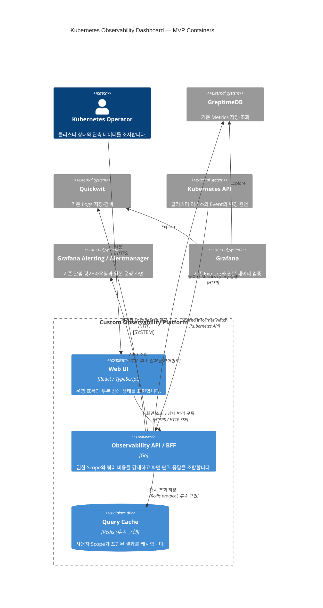
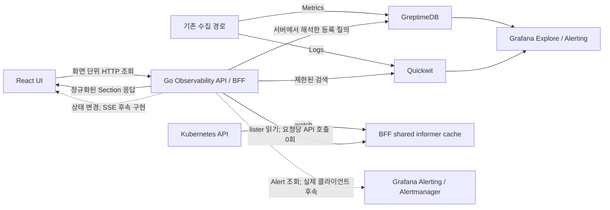

# ADR 0005 — MVP는 기존 관측 스택과 전용 BFF/UI를 결합한 하이브리드 아키텍처로 구성한다

- 상태: Accepted
- 날짜: 2026-08-14
- 결정자: @xenx96
- 관련: 이슈 [#2](https://github.com/xenx96/k8s-dashboard/issues/2) · README §2 핵심 설계 원칙, §3 목표 아키텍처, §8 MVP 범위 · ADR 0002, ADR 0004

## 배경

현재 운영 환경에는 Grafana, GreptimeDB, Quickwit과 Kubernetes API가 이미 있습니다. MVP의 목적은
이 수집·저장·알림 계층을 다시 만드는 것이 아니라 Kubernetes 장애 조사 흐름에 맞춘 화면과 안전한
통합 조회 경계를 추가하는 것입니다.

브라우저가 각 데이터소스와 Kubernetes API를 직접 호출하면 credential과 raw query가 노출되고,
Cluster/Namespace 권한·쿼리 비용·응답 형태를 한곳에서 강제할 수 없습니다. 반대로 기존 스택만으로는
Cluster → Namespace → Workload → Pod/Container의 일관된 드릴다운과 부분 장애 표현을 제공하기
어렵습니다.

## 결정

**MVP는 기존 Grafana·GreptimeDB·Quickwit을 재사용하고 React UI가 Go Observability API/BFF만
호출하는 하이브리드 아키텍처로 구성합니다.** 브라우저가 데이터소스나 Kubernetes API를 직접
호출하는 경로는 만들지 않습니다.

### 책임 경계

| 책임 | 담당 | MVP 경계 |
|---|---|---|
| 수집 | 현재 운영 중인 수집기와 Kubernetes watch/informer | 새 수집 파이프라인을 만들지 않습니다. Kubernetes 상태는 BFF의 shared informer cache가 수신합니다. |
| 저장 | Metrics는 GreptimeDB, Logs는 Quickwit | BFF와 브라우저는 관측 원본을 별도 저장하지 않습니다. |
| 조회·정책 | Go Observability API/BFF | 인증·권한 Scope, Query Catalog, 비용 제한, 데이터소스 fan-out, 응답 정규화와 부분 장애를 강제합니다. 요청 경로에서는 informer cache만 읽습니다. |
| 표현 | React/TypeScript UI | 화면 단위 BFF 계약을 렌더링하고 드릴다운합니다. raw PromQL/SQL/Quickwit query나 데이터소스 credential을 보유하지 않습니다. |
| 알림 | 기존 Grafana Alerting 또는 Alertmanager, 조회 전용 UI | 규칙 평가·Silence·Grouping·Routing·Notification을 새로 구현하지 않습니다. Alertmanager 실제 클라이언트는 후속 작업입니다. |

시계열 Metrics는 범위·step·최대 포인트를 서버가 강제한 **HTTP 조회**로 전달합니다. Pod, Workload,
Kubernetes Event, Alert 같은 상태 변경은 **SSE**로 전달합니다. SSE가 완성되기 전에는 이 경로를
구현 완료로 간주하지 않습니다. 양방향 통신 요구가 생길 때만 WebSocket을 별도 결정으로 검토합니다.

MVP 배포와 권한 경계는 **단일 Kubernetes 클러스터**를 기준으로 합니다. Multi-cluster 중앙 Agent와
클러스터 간 통합 조회는 **Post-MVP**이며, MVP 계약에 미리 끼워 넣지 않습니다.

### C4 Container Diagram

그림에서 Redis와 Alertmanager 연동은 목표 컨테이너 경계이며 현재 구현 완료를 뜻하지 않습니다.
브라우저에서 BFF 이외의 시스템으로 향하는 관계는 의도적으로 없습니다.

### 주요 데이터 흐름

수집 데이터는 기존 저장소로 들어갑니다. UI는 `queryRef`만 요청하고, BFF가 이를 서버에 등록된
질의로 해석해 서버가 적용한 Scope와 함께 데이터소스를 조회합니다. Kubernetes 상태는 장기 watch로
채운 informer cache에서 읽어 요청 수와 무관하게
API 서버 부하를 유지합니다. BFF가 각 결과를 화면 단위 `Section<T>`로 정규화해 UI에 반환하므로
일부 upstream 장애가 전체 화면 장애로 번지지 않습니다.

## 검토한 대안

| 대안 | 기각 사유 |
|---|---|
| Grafana 대시보드만 확장 | Kubernetes 운영 흐름에 특화된 드릴다운과 공통 엔티티 모델, 화면 단위 부분 장애 계약을 충분히 제어하기 어렵습니다. Grafana는 Explore·Alerting 용도로 유지합니다. |
| 브라우저가 GreptimeDB·Quickwit·Kubernetes API를 직접 호출 | credential과 raw query를 노출하고 서버 권한 Scope·쿼리 비용·로그 마스킹을 우회할 수 있어 보안 경계를 위반합니다. |
| 수집·저장·알림까지 자체 플랫폼으로 재구현 | 검증된 기존 계층을 중복 구현해 MVP 범위와 운영 위험을 불필요하게 키웁니다. |
| 모든 데이터에 SSE 또는 WebSocket 사용 | 대용량 과거 시계열은 범위 기반 HTTP 조회와 서버 downsampling이 적합합니다. 연결 상태와 재시도 복잡도를 시계열까지 확장할 이유가 없습니다. |
| Multi-cluster를 MVP에 포함 | 중앙 Agent, 클러스터 식별·격리, 장애 전파와 운영 모델이 추가되어 단일 클러스터 핵심 흐름 검증을 지연시킵니다. |

## 결과

**좋아지는 것**

- 검증된 수집·저장·알림 계층을 유지하면서 Kubernetes 운영 흐름에 맞춘 UX를 제공합니다.
- 모든 사용자 데이터 접근이 BFF 하나를 지나 권한 Scope, query allowlist, 비용 상한과 로그 마스킹을
  같은 경계에서 강제할 수 있습니다.
- HTTP 시계열과 SSE 상태 변경을 분리해 전송 방식이 데이터 특성에 맞습니다.
- 데이터소스 일부 장애를 화면 단위 `Section<T>` 상태로 격리할 수 있습니다.

**감수하는 것과 위험**

- BFF가 데이터소스 fan-out과 정책 집행의 중심이 되어 병목 또는 단일 장애 지점이 될 수 있습니다.
  데이터소스별 timeout·circuit breaker, 캐시와 자체 관측이 필요합니다.
- UI, BFF, 기존 시스템 사이의 계약과 버전 호환을 유지해야 합니다.
- informer cache는 초기 LIST 메모리와 API 서버 부하가 있으므로 대규모 클러스터에서 실측해야 합니다.
- SSE 재연결, 이벤트 유실 복구와 사용자 Scope 격리는 아직 검증해야 합니다.
- 단일 클러스터 MVP 결정 때문에 이후 Multi-cluster 도입 시 식별자와 배포 경계를 다시 검토해야 합니다.

## 후속 작업

- [ ] Redis 캐시와 사용자 Scope를 포함한 캐시 키 적용 (이슈 #11)
- [ ] 상태 변경 SSE, 재연결·유실 복구와 Scope 격리 구현 (이슈 #12)
- [ ] Grafana Alerting 또는 Alertmanager 실제 조회 클라이언트 구현
- [ ] React UI를 화면 단위 BFF 계약에 실연결하고 통합 E2E로 부분 장애 검증
- [ ] 배포·운영 설정과 데이터소스별 timeout·circuit breaker 수치 확정
- [ ] Post-MVP Multi-cluster 요구가 구체화되면 별도 Proposed ADR 작성
