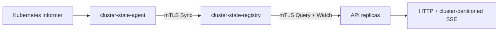
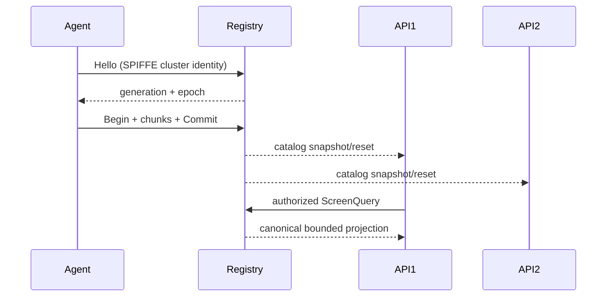
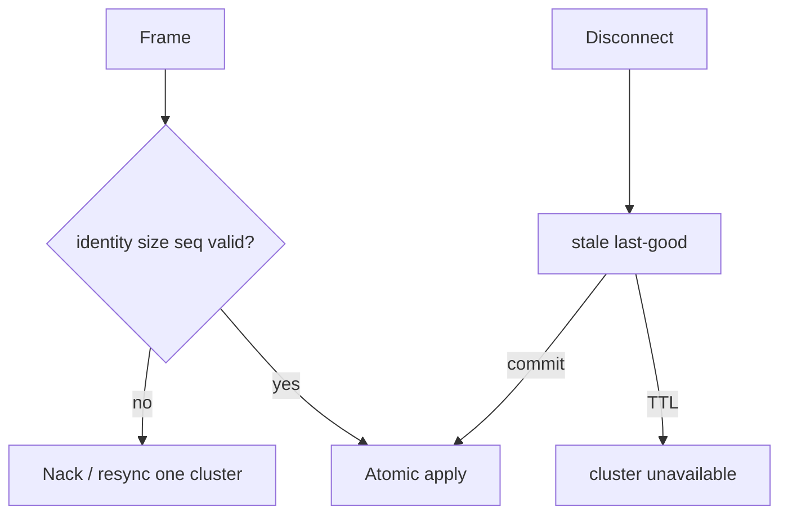

# ADR 0010: 멀티 클러스터 상태 Agent와 중앙 Registry

- 상태: Proposed
- 날짜: 2026-08-15
- 문서 수준: C (인증·네트워크·배포 포함, 위험 점수 20)

> 기본 `direct` 동작은 유지한다. opt-in `central` 모드에서는 outbound-only Agent가 정규화한 상태를 singleton Registry에 전달하고 모든 API replica가 같은 authoritative snapshot을 화면당 한 번 조회한다.

## 아키텍처

Registry가 closed protobuf의 kind, UID, identity, 필드, 개수와 실제 encoded bytes를 다시 검증한다. Secret, ConfigMap, Pod env/envFrom, command, args, volume, token, kubeconfig를 표현할 wire 필드는 없다.

## 결정과 대안

| 선택지 | 장점 | 단점 |
|---|---|---|
| API가 모든 kubeconfig 보유 | 단순 | 자격증명 blast radius, replica별 state 불일치 |
| PostgreSQL/OTel을 상태 버스로 재사용 | 기존 구성 활용 | #23/#24 책임과 충돌 |
| 별도 Agent + singleton Registry | outbound-only, replica 공통 snapshot, 장애 격리 | 초기 Registry SPOF |

세 번째 선택지를 채택한다. Registry HA와 운영 복구 조건이 입증될 때까지 상태는 Proposed다.

## 보안과 장애 경계

| 위협/장애 | 완화 |
|---|---|
| 잘못된 인증서/역할/cluster ID | 정확히 하나인 canonical SPIFFE URI SAN과 frame identity 검사 |
| gap, duplicate, old session | generation 원자 검증, duplicate 무시, gap full resync |
| oversized/flood | per-cluster/global bytes·resource·queue·rate cap |
| agent 단절 | TTL 동안 stale/degraded, 이후 해당 cluster만 unavailable |
| Registry 재시작 | Agent 전체 snapshot 재전송; API readiness는 Registry 인프라만 반영 |
| 교차 노출 | qualified OIDC role, cache/query/SSE/catalog/usage cluster partition |

Registry/API/Agent는 별도 leaf Secret을 사용한다. 동일 공개 CA trust root는 허용하지만 CA private key는 Pod에 배포하지 않으며, agent/query listener가 SPIFFE 역할을 분리한다.

## 운영·롤백·비목표

Registry는 connection, stale, resync, Nack, ingress rate, retained bytes/resources, Query latency를 cluster별 bounded label로 관측한다. Alertmanager 실제 client가 없으므로 central alert Section은 unavailable이며 demo 데이터를 섞지 않는다.

롤백은 Agent 중지, 기존 단일 클러스터 RBAC 복구, `clusterState.mode=direct` 전환 순서다. Registry는 메모리 전용이므로 데이터 migration은 없다. 절차는 [운영 런북](../runbooks/multi-cluster-state.md)을 따른다.

#23 OTel metrics/logs와 #24 PostgreSQL draft metadata는 상태 버스가 아니다. Registry HA/persistence 및 Alertmanager 실제 multi-cluster client는 후속 범위다.
