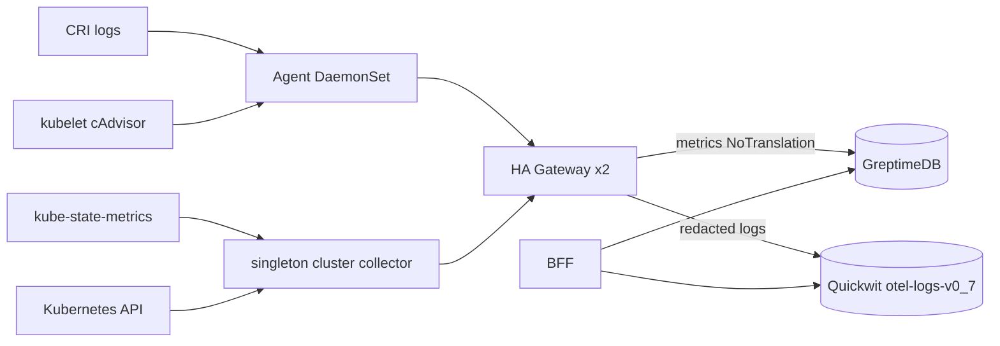
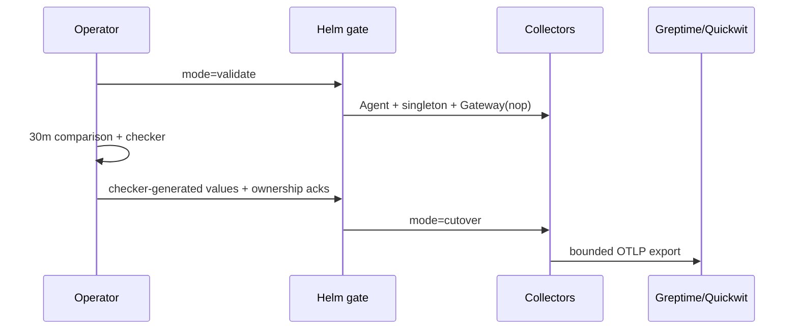
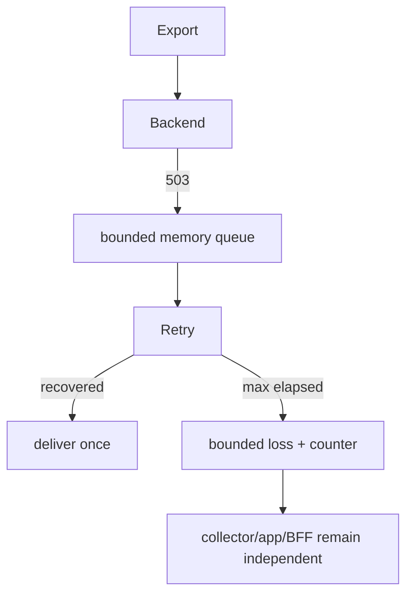

# 🛰 OpenTelemetry Agent/Gateway — Technical Spec

| Field | Value |
|---|---|
| Author | Codex |
| Date | 2026-08-15 |
| Level | C |
| Risk Score | 24 🔴 |
| Status | Draft; ADR 0008 Proposed |

> **TL;DR:** Opt-in Agent/singleton cluster collector/HA Gateway가 logs와 Query Catalog metrics를 중복 없이 GreptimeDB·Quickwit으로 전달한다. cutover는 ownership·schema·network·실측 evidence가 모두 맞을 때만 열린다.

---

## 🧾 Changed Files

| File | Change | Layer |
|---|---|---|
| `deploy/helm/observability-dashboard/templates/telemetry-*.yaml` | Collector config/workload/RBAC/NetworkPolicy | Deployment |
| `deploy/scripts/test-telemetry-protocol.py` | actual Collector/Greptime/Quickwit protocol fixture | Integration |
| `apps/api/internal/datasource/quickwit/*` | bounded nested OTLP field resolver | BFF adapter |
| `docs/adr/0008-*`, `docs/telemetry/*` | decision, inventory, runbook | Operations |

---

## 🏛 Architecture

---

## 🔁 Sequence Diagram

---

## 🧩 API Spec

| Protocol | Endpoint | Payload | 비고 |
|---|---|---|---|
| OTLP/HTTP | Greptime base `/v1/otlp` | metrics protobuf | 실제 path `/v1/otlp/v1/metrics`, DB/NoTranslation headers |
| OTLP/gRPC | Quickwit `:7281` | logs protobuf | exact index header `otel-logs-v0_7` |
| HTTP | BFF `GREPTIME_URL`, `QUICKWIT_URL` | PromQL/search | ingest endpoint와 별개 |

---

## ⚖️ Decisions & Trade-offs

| 결정 | 장점 | 비용 |
|---|---|---|
| singleton KSM/cluster owner | 중복 없음 | rollout 중 짧은 metric 공백 |
| process-local filelog checkpoint | writable host state 불필요 | restart/downtime log loss 가능 |
| in-memory bounded queue | disk secret/권한 없음 | retry window 이후 loss |

---

## 🧯 Edge Cases

| Scenario | Impact | Mitigation |
|---|---|---|
| backend 503 후 회복 | 지연 | retry 후 한 번 전달 fixture |
| backend 장기 장애 | bounded drop | health 유지, dropped counter, rollback |
| Quickwit index 미생성/schema drift | permanent export error | cutover 전 create/readback |
| kubelet IP SAN 없음 | scrape 실패 | 인증서 수정, insecure 금지 |

---

## 🔐 Security Notes

- Secret 값은 기존 Secret key reference로만 주입한다.
- Agent/cluster RBAC를 분리하고 Gateway는 Kubernetes API 권한을 갖지 않는다.
- PII body redaction과 attribute allowlist를 Quickwit 전에 실행한다.
- NetworkPolicy는 Agent/cluster→Gateway와 명시 CIDR/port만 허용한다.

---

## 🧨 Threat Model

| Threat | Vector | Likelihood | Impact | Mitigation |
|---|---|---|---|---|
| secret 유출 | log body/attribute | Medium | High | transform redaction + actual stored-source assertion |
| metric cardinality 폭증 | kubelet/KSM labels | Medium | High | six-name allowlist + datapoint keep_keys |
| dual write | 기존 collector 미중지 | Medium | High | signal별 ack와 fail-closed Helm gate |
| evidence 변조 | 수기 values | Medium | High | full artifact hash/checker-generated overlay |

---

## 🧯 Failure Flow

---

## ↩️ Rollback Plan

| Step | Action | Verification |
|---|---|---|
| 1 | telemetry `disabled` 적용 | 새 exporter traffic 0 |
| 2 | 기존 collectors 복구 | 기존 backend counters 증가 |
| 3 | 9 metrics/Quickwit query 확인 | no dual-write, expected data |

> **Data impact:** 이미 backend에 기록된 데이터는 자동 삭제하지 않으며 restart window의 filelog loss는 복구되지 않을 수 있다.

---

## 📈 Observability Plan

| Signal | Metric/log | Gate |
|---|---|---|
| loss | raw baseline/candidate, refused/dropped | operator limit 이하 |
| latency | source→searchable p95 | operator limit 이하 |
| resource | Collector CPU/RSS | pod limit·limiter 이하 |
| volume | egress/storage/cost | operator limit 이하 |

---

## 🧪 Test Notes

- [x] default disabled byte parity, Helm lint, kubeconform, policy
- [x] pinned contrib components/config validate and core negative
- [x] fake Prom→mock OTLP, injected 503 retry/no duplicate
- [x] real Greptime 9 queries and Quickwit OTLP→BFF
- [ ] production stage 30m measurement and cutover approval
